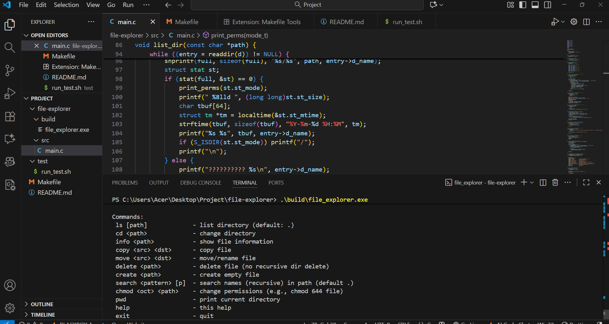
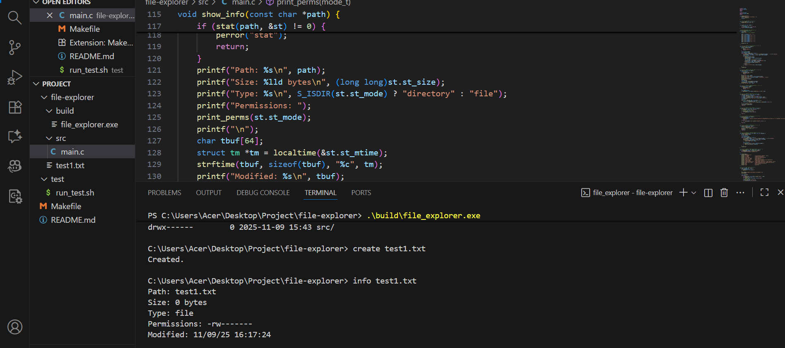
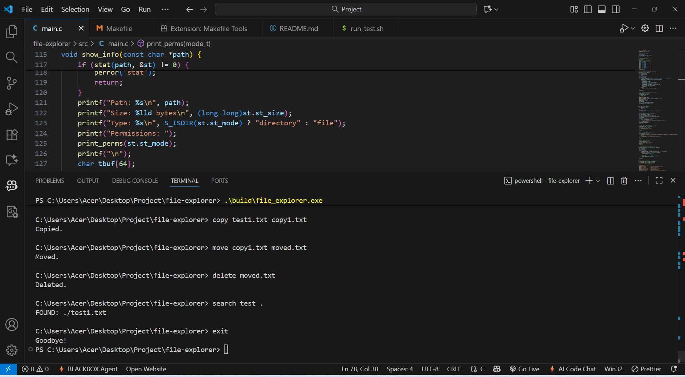

# File Explorer — Capstone Project

Name: Piyush Mishra 
Course: Capstone Project (Linux System Programming)  
Submission Date:09/11/2025  

---

## 1. Title  
**File Explorer** — A command-line file management system implemented in C that performs directory navigation and file operations.

---

## 2. Codes  
**Main File:** `src/main.c`  
Implements file operations using system calls (`opendir`, `readdir`, `stat`, `chmod`, etc.).  
**Key features:**
- List files and directories (`ls`)
- Show current directory (`pwd`)
- Create, copy, move, and delete files
- Display file information (`info`)
- Search files recursively (`search`)
- Modify file permissions (`chmod`)

**Other files:**
- `Makefile` — for building project  
- `test/run_test.sh` — script for testing  
- `README.md` — setup and usage  
- `REPORT.md` — project documentation  

---

## 3. Full Screenshots

### Program Start  

### Directory Listing and PWD  

### Create and Info  

### Operations (Copy, Move, Delete, Search)  

---

## GitHub Repository  
🔗 [https://github.com/your-username/file-explorer](https://github.com/your-username/file-explorer)

---

## Conclusion  
This File Explorer demonstrates Linux system call usage and file handling in C.  
It provides an interactive terminal interface for performing essential file operations efficiently.

